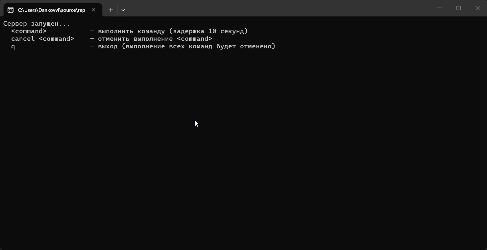

## Что это?
Консольное демо-приложение, иллюстрирующее работу с `CancellationTokenSource.CreateLinkedTokenSource`.
Пользователь может запускать длительные задачи (с задержкой 10 секунд), отменять конкретную задачу по имени или завершить всё приложение с отменой всех активных задач.

## Зачем это нужно?
Тема «Токены отмены» часто вызывает сложности у новичков, особенно момент, когда нужно:
- создать один общий источник отмены (например, для выхода из приложения),
- при этом иметь возможность отменять отдельные задачи независимо,
- корректно освобождать ресурсы и дожидаться завершения всех задач.

Демонстрация показывает именно это — с использованием `CreateLinkedTokenSource`.

## Особенности реализации
- **Без `async/await`** – код рассчитан на уровень курса до введения асинхронных методов.
- Прерываемая задержка через `CancellationToken.WaitHandle.WaitOne`.
- Потокобезопасный доступ к коллекциям (`lock`).
- Правильное управление временем жизни `CancellationTokenSource`: отмена персонального токена без немедленного удаления, `Dispose` только после завершения задачи.
- При вводе `q` – общий токен отменяется, и программа ожидает завершения всех задач (`Task.WaitAll`), чтобы пользователь увидел сообщения об отмене.

## Как запустить и проверить
1. Запустить приложение.
2. Ввести любое имя команды, например `task1`. Появится сообщение «Начато выполнение задачи: task1».
3. Ввести `task2` – запустится вторая задача.
4. Ввести `cancel task1`. Почти сразу появится «Задача task1 отменена.»
5. Дождаться истечения 10 секунд для `task2` – появится «Обработан запрос: task2».
6. Запустить несколько задач и ввести `q` – все они отменяются, приложение завершается.

## Превью:
